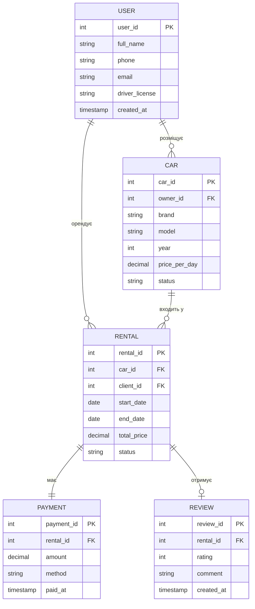

# Лабораторна робота 1: Збір вимог та розробка схеми ER

**Система:** Платформа прокату автомобілів 

---

## 1. Виклад вимог

### 1.1 Призначення системи

Система є вебплатформою для peer-to-peer прокату автомобілів — аналогом Airbnb, але для транспортних засобів. Будь-який зареєстрований користувач може виступати як **орендодавець** (розміщувати своє авто) та/або як **орендар** (бронювати чужий автомобіль). Платформа забезпечує пошук доступних авто, оформлення оренди, прийом оплати та збір відгуків після завершення поїздки.

### 1.2 Зацікавлені сторони та їхні потреби

| Зацікавлена сторона | Потреби |
|---|---|
| Орендодавець | Реєстрація акаунту, розміщення авто з описом і ціною, перегляд своїх оренд, читання відгуків |
| Орендар | Пошук та бронювання авто, оплата, залишення відгуку після оренди |

### 1.3 Дані для зберігання

- Облікові записи користувачів (ім'я, контакти, водійське посвідчення)
- Інформація про автомобілі (марка, модель, рік, ціна, поточний статус)
- Записи оренд (хто, що, коли орендував, загальна вартість)
- Платежі за кожну оренду (сума, спосіб, дата)
- Відгуки орендарів після завершення оренди (рейтинг, коментар)

### 1.4 Бізнес-правила

1. Один користувач може одночасно бути і орендодавцем, і орендарем.
2. Орендодавець не може орендувати власне авто.
3. Автомобіль має статус: `available`, `rented`, `maintenance`.
4. Оренда має статус: `pending`, `active`, `completed`, `cancelled`.
5. Кожна оренда має рівно один платіж.
6. Відгук можна залишити лише після завершення оренди (`completed`), і лише один раз.
7. Рейтинг у відгуку — ціле число від 1 до 5.
8. Дата закінчення оренди повинна бути пізніше дати початку.

---

## 2. ER-діаграма

---

## 3. Сутності та атрибути

### 3.1 USER (Користувач)

Центральна сутність платформи. Один запис представляє одну фізичну особу незалежно від її ролі.

| Атрибут | Тип | Опис |
|---|---|---|
| `user_id` | int | Первинний ключ |
| `full_name` | string | Повне ім'я |
| `phone` | string | Номер телефону |
| `email` | string | Електронна пошта (унікальна) |
| `driver_license` | string | Номер водійського посвідчення |
| `created_at` | timestamp | Дата реєстрації |

### 3.2 CAR (Автомобіль)

Транспортний засіб, виставлений для оренди. Прив'язаний до власника через `owner_id`.

| Атрибут | Тип | Опис |
|---|---|---|
| `car_id` | int | Первинний ключ |
| `owner_id` | int (FK) | Посилання на `USER` — власник авто |
| `brand` | string | Марка (Toyota, BMW тощо) |
| `model` | string | Модель |
| `year` | int | Рік випуску |
| `price_per_day` | decimal | Ціна оренди за добу |
| `status` | string | Поточний статус: `available`, `rented`, `maintenance` |

### 3.3 RENTAL (Оренда)

Асоціативна сутність між `USER` (у ролі клієнта) і `CAR`. Фіксує факт оренди.

| Атрибут | Тип | Опис |
|---|---|---|
| `rental_id` | int | Первинний ключ |
| `car_id` | int (FK) | Посилання на орендоване авто |
| `client_id` | int (FK) | Посилання на `USER` — орендар |
| `start_date` | date | Дата початку оренди |
| `end_date` | date | Дата закінчення оренди |
| `total_price` | decimal | Загальна вартість (обчислюється при бронюванні) |
| `status` | string | Статус: `pending`, `active`, `completed`, `cancelled` |

### 3.4 PAYMENT (Платіж)

Один платіж на одну оренду. Зберігає фінансові деталі транзакції.

| Атрибут | Тип | Опис |
|---|---|---|
| `payment_id` | int | Первинний ключ |
| `rental_id` | int (FK) | Посилання на `RENTAL` (унікальне) |
| `amount` | decimal | Сума платежу |
| `method` | string | Спосіб оплати: `card`, `cash`, `online` |
| `paid_at` | timestamp | Час проведення оплати |

### 3.5 REVIEW (Відгук)

Необов'язковий відгук орендаря після завершення оренди. Кожна оренда може мати щонайбільше один відгук.

| Атрибут | Тип | Опис |
|---|---|---|
| `review_id` | int | Первинний ключ |
| `rental_id` | int (FK) | Посилання на `RENTAL` (унікальне) |
| `rating` | int | Оцінка від 1 до 5 |
| `comment` | string | Текстовий коментар (необов'язковий) |
| `created_at` | timestamp | Дата публікації відгуку |

---

## 4. Зв'язки між сутностями

**USER → CAR (один до багатьох)**  
Один користувач може розмістити необмежену кількість автомобілів. Кожен автомобіль належить рівно одному власнику. Реалізується через `car.owner_id → user.user_id`.

**USER → RENTAL (один до багатьох)**  
Один користувач може виступати орендарем у багатьох орендах. Кожна оренда прив'язана до одного клієнта. Реалізується через `rental.client_id → user.user_id`.

**CAR → RENTAL (один до багатьох)**  
Одне авто може брати участь у багатьох орендах послідовно. Кожна оренда стосується рівно одного автомобіля. Реалізується через `rental.car_id → car.car_id`.

**RENTAL → PAYMENT (один до одного)**  
Кожна оренда має рівно один платіж. Зв'язок обов'язковий з обох сторін. Реалізується через `payment.rental_id → rental.rental_id` з унікальним обмеженням.

**RENTAL → REVIEW (один до нуля-або-одного)**  
Оренда може мати щонайбільше один відгук — залишати його необов'язково. Відгук не може існувати без оренди. Реалізується через `review.rental_id → rental.rental_id` з унікальним обмеженням.

---

## 5. Припущення та обмеження

1. **Єдина роль-сутність.** Орендодавець і орендар — це не окремі таблиці, а ролі одного запису `USER`. Це спрощує схему і відповідає реальній поведінці платформи.
2. **Самооренда заборонена.** На рівні бізнес-логіки: `rental.client_id ≠ car.owner_id`. В схемі не відображається — перевіряється в застосунку або тригером.
3. **Один платіж на оренду.** Часткові або розбиті платежі не підтримуються в поточній версії схеми.
4. **Один відгук на оренду.** Повторне редагування відгуку не передбачено.
5. **Рейтинг: 1–5.** Обмеження `CHECK (rating BETWEEN 1 AND 5)` буде додано у Лабораторній роботі 2.
6. **Ціна фіксується при бронюванні.** `total_price` у `RENTAL` зберігає розраховану вартість на момент оформлення, щоб зміна `price_per_day` у `CAR` не впливала на старі записи.
7. **Статуси.** Перелік допустимих значень для `status` у `CAR` і `RENTAL` буде реалізовано через `ENUM` або `CHECK` у PostgreSQL (Лабораторна робота 2).
